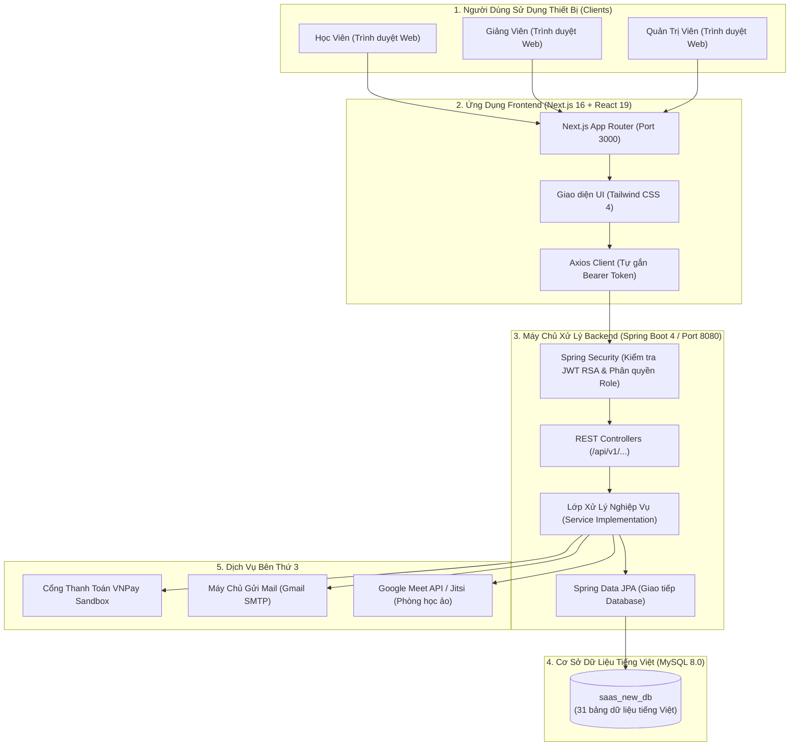
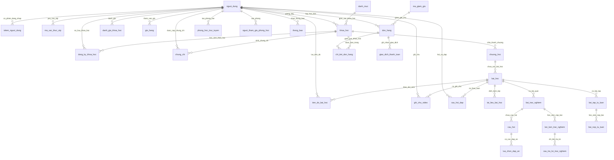
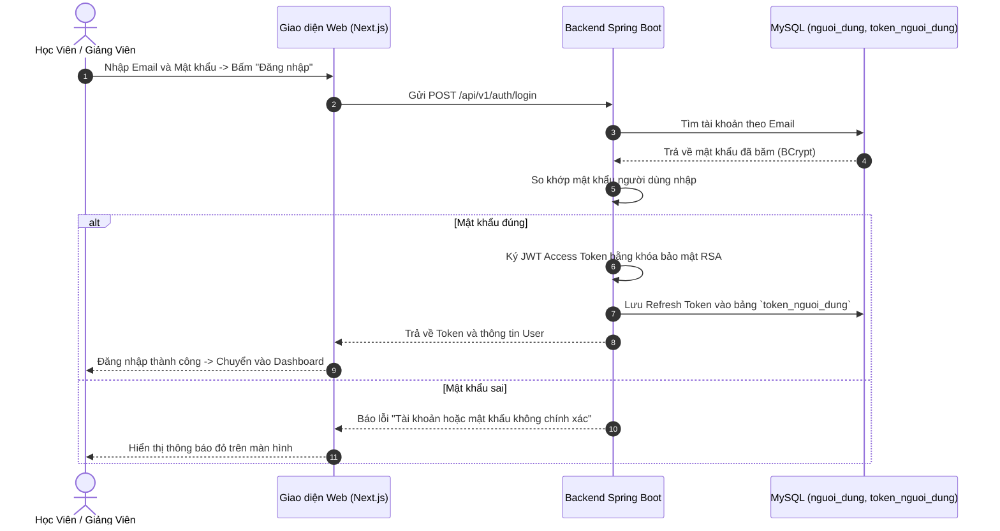
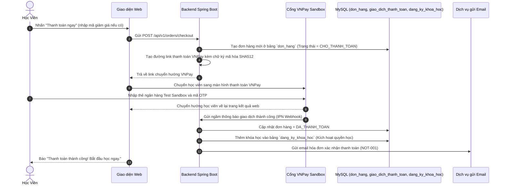
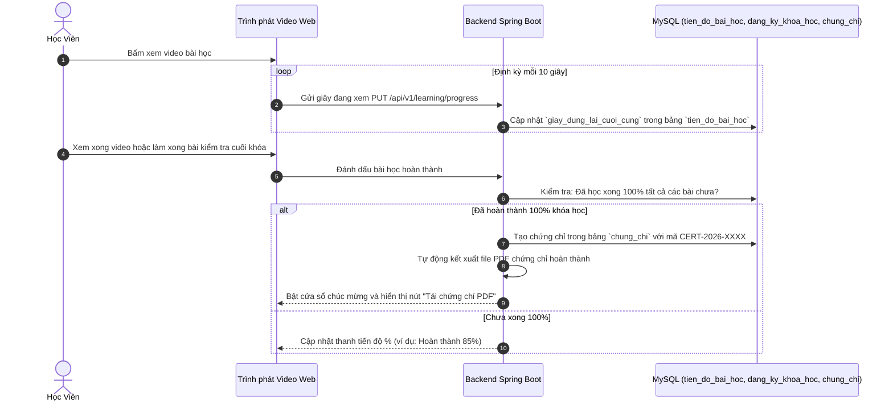
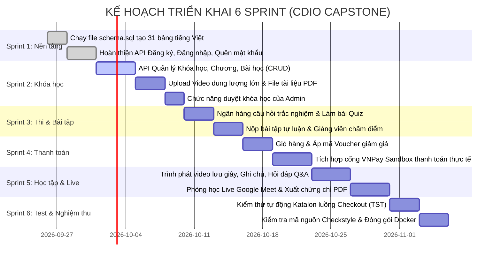

# KẾ HOẠCH PHÂN TÍCH KIẾN TRÚC & TRIỂN KHAI HỆ THỐNG
## DỰ ÁN: NỀN TẢNG HỌC TRỰC TUYẾN E-LEARNING / LMS SAAS (CDIO CAPSTONE)

> **Tài liệu tham chiếu chính:**  
> - Bảng đặc tả Use Case: [usercase.md](file:///d:/SAAS/CDIO/usercase.md)  
> - File tạo Database tiếng Việt: [schema.sql](file:///d:/SAAS/CDIO/schema.sql)  
> - Mã nguồn Backend: [backend/](file:///d:/SAAS/CDIO/backend/)

---

## 📑 MỤC LỤC
1. [Tổng Quan Dự Án & 4 Vai Trò Người Dùng](#1-tổng-quan-dự-án--4-vai-trò-người-dùng)
2. [Chi Tiết 30 Use Cases Dễ Hiểu (Kèm API & Bảng Dữ Liệu)](#2-chi-tiết-30-use-cases-dễ-hiểu-kèm-api--bảng-dữ-liệu)
3. [Kiến Trúc Tổng Thể & Luồng Dữ Liệu](#3-kiến-trúc-tổng-thể--luồng-dữ-liệu)
4. [Mô Hình Dữ Liệu Tiếng Việt & Sơ Đồ ERD](#4-mô-hình-dữ-liệu-tiếng-việt--sơ-đồ-erd)
5. [Thiết Kế Backend (Spring Boot 4 / Java 17)](#5-thiết-kế-backend-spring-boot-4--java-17)
6. [Thiết Kế Frontend (Next.js 16 / React 19 / Tailwind CSS 4)](#6-thiết-kế-frontend-nextjs-16--react-19--tailwind-css-4)
7. [3 Luồng Nghiệp Vụ Cốt Lõi Từng Bước (Sequence Flows)](#7-3-luồng-nghiệp-vụ-cốt-lõi-từng-bước-sequence-flows)
8. [Kế Hoạch Triển Khai Chi Tiết Theo 6 Sprint](#8-kế-hoạch-triển-khai-chi-tiết-theo-6-sprint)
9. [Kịch Bản Kiểm Thử Tự Động Katalon (TST-001) & Chuẩn CDIO](#9-kịch-bản-kiểm-thử-tự-động-katalon-tst-001--chuẩn-cdio)

---

## 1. Tổng Quan Dự Án & 4 Vai Trò Người Dùng

### 1.1. Mục tiêu dự án
Hệ thống **E-Learning LMS SaaS** là một nền tảng bán khóa học và học tập trực tuyến hoàn chỉnh. Học viên có thể tìm kiếm, thêm khóa học vào giỏ, thanh toán online qua VNPay, xem video bài giảng, ghi chú theo giây (timestamp), làm trắc nghiệm tự động chấm, nộp bài tự luận, họp trực tuyến qua Google Meet và nhận chứng chỉ PDF tự động khi học xong.

### 1.2. Hệ thống phục vụ ai? (4 Vai trò chính)
| Vai trò (Role) | Ký hiệu trong DB | Họ làm gì trên hệ thống? |
| :--- | :--- | :--- |
| **1. Học viên (Student)** | `ROLE_USER` | Đăng ký, đăng nhập, tìm kiếm khóa học, mua qua VNPay, học video, ghi chú, làm quiz, thảo luận hỏi đáp Q&A, nhận chứng chỉ PDF. |
| **2. Giảng viên (Instructor)** | `ROLE_INSTRUCTOR` | Tạo khóa học, tải lên video & tài liệu PDF/Zip, soạn câu hỏi trắc nghiệm, tạo bài tập tự luận và chấm điểm, tạo phòng học Live Google Meet, tạo mã giảm giá. |
| **3. Quản trị viên (Admin)** | `ROLE_ADMIN` | Quản lý danh sách người dùng và phân quyền, duyệt hoặc từ chối khóa học của giảng viên, xem biểu đồ doanh thu, cài đặt banner trang chủ. |
| **4. Kiểm thử viên (QA/Tester)** | QA Team | Chạy kịch bản kiểm thử tự động (Automation Test) bằng Katalon Studio cho luồng đặt hàng và thanh toán VNPay. |

---

## 2. Chi Tiết 30 Use Cases Dễ Hiểu (Kèm API & Bảng Dữ Liệu)

Dưới đây là bảng giải thích cụ thể từng use case trong [usercase.md](file:///d:/SAAS/CDIO/usercase.md). Bất kỳ lập trình viên nào nhìn vào cũng biết rõ: **Ai làm gì -> Gọi API nào -> Lưu vào bảng nào trong cơ sở dữ liệu**.

### 🔹 Phân hệ 1: Xác thực & Tài khoản (USR-001 -> USR-005, ADM-001)
| Mã Use Case | Tên chức năng | Ai làm? | Giải thích cách hoạt động dễ hiểu | API Endpoint | Bảng DB liên quan |
| :--- | :--- | :--- | :--- | :--- | :--- |
| **USR-001** | Đăng ký tài khoản | Học viên / Giảng viên | Nhập Email, Mật khẩu, Họ tên, chọn Vai trò. Hệ thống băm mật khẩu bằng BCrypt và lưu tài khoản. | `POST /api/v1/auth/register` | `nguoi_dung` |
| **USR-002** | Đăng nhập hệ thống | Học viên / Giảng viên | Nhập Email và Mật khẩu. Hệ thống kiểm tra đúng thì trả về cặp JWT Token (Access Token + Refresh Token). | `POST /api/v1/auth/login` | `nguoi_dung`, `token_nguoi_dung` |
| **USR-003** | Đăng xuất | Học viên / Giảng viên | Người dùng nhấn Đăng xuất. Hệ thống thu hồi Refresh Token (`da_thu_hoi = true`), xóa cookie đăng nhập. | `POST /api/v1/auth/logout` | `token_nguoi_dung` |
| **USR-004** | Quên mật khẩu | Học viên / Giảng viên | Nhập email nhận mã OTP 6 số qua hộp thư. Nhập mã OTP cùng mật khẩu mới để đổi lại mật khẩu. | `POST /api/v1/auth/forgot-password`<br>`POST /api/v1/auth/reset-password` | `ma_xac_thuc_otp`, `nguoi_dung`, `nhat_ky_email` |
| **USR-005** | Cập nhật hồ sơ cá nhân | Học viên / Giảng viên | Thay đổi họ tên, số điện thoại, đổi ảnh đại diện (avatar), viết tiểu sử giới thiệu. | `PUT /api/v1/users/profile` | `nguoi_dung` |
| **ADM-001** | Quản lý người dùng & Phân quyền | Quản trị viên (Admin) | Xem danh sách tài khoản, khóa hoặc mở khóa tài khoản, nâng quyền thành Giảng viên hoặc Admin. | `GET /api/v1/admin/users`<br>`PUT /api/v1/admin/users/{id}/role` | `nguoi_dung` |

---

### 🔹 Phân hệ 2: Khóa học & Nội dung (CRS-001 -> CRS-005, ADM-003, ADM-004)
| Mã Use Case | Tên chức năng | Ai làm? | Giải thích cách hoạt động dễ hiểu | API Endpoint | Bảng DB liên quan |
| :--- | :--- | :--- | :--- | :--- | :--- |
| **CRS-001** | Thêm khóa học mới | Giảng viên | Tạo tiêu đề khóa học, giá tiền, ảnh bìa, tạo các Chương học (Chương 1, 2, 3...) và các Bài học. | `POST /api/v1/instructor/courses`<br>`POST /api/v1/instructor/sections` | `khoa_hoc`, `chuong_hoc`, `bai_hoc` |
| **CRS-002** | Tải lên video bài giảng | Giảng viên | Đăng tải file video bài học lên máy chủ. Xử lý upload file lớn bằng Multipart Streaming. | `POST /api/v1/instructor/lessons/{id}/video` | `bai_hoc` |
| **CRS-003** | Tìm kiếm & Lọc theo danh mục | Học viên | Tìm khóa học theo từ khóa hoặc lọc theo nhóm ngành (Lập trình, Đồ họa, Ngoại ngữ). | `GET /api/v1/courses?danhMucId=...&tuKhoa=...` | `danh_muc`, `khoa_hoc` |
| **CRS-004** | Chấm điểm & Bình luận (Review) | Học viên đã mua khóa | Học viên đánh giá từ 1 đến 5 sao và viết nhận xét về chất lượng khóa học. Điểm trung bình tự động tính lại. | `POST /api/v1/courses/{id}/reviews` | `danh_gia_khoa_hoc`, `khoa_hoc` |
| **CRS-005** | Upload file tài liệu đính kèm | Giảng viên | Tải lên file PDF đề cương hoặc file Zip mã nguồn mẫu cho bài học để học viên tải về. | `POST /api/v1/instructor/lessons/{id}/resources` | `tai_lieu_bai_hoc` |
| **ADM-003** | Phê duyệt khóa học | Quản trị viên (Admin) | Xem xét nội dung khóa học giảng viên gửi lên. Nhấn Duyệt (`DA_XUAT_BAN`) để bán công khai hoặc Từ chối kèm lý do. | `PUT /api/v1/admin/courses/{id}/status` | `khoa_hoc` |
| **ADM-004** | Quản lý Banner trang chủ | Quản trị viên (Admin) | Thêm, sửa, xóa các banner hình ảnh khuyến mãi trượt trên trang chủ kèm link chuyển hướng. | `POST /api/v1/admin/banners`<br>`GET /api/v1/banners` | `banner` |

---

### 🔹 Phân hệ 3: Ngân hàng câu hỏi, Trắc nghiệm & Bài tập (CRS-006, CRS-007, LRN-002)
| Mã Use Case | Tên chức năng | Ai làm? | Giải thích cách hoạt động dễ hiểu | API Endpoint | Bảng DB liên quan |
| :--- | :--- | :--- | :--- | :--- | :--- |
| **CRS-006** | Ngân hàng câu hỏi trắc nghiệm | Giảng viên | Tạo kho câu hỏi (nội dung, các đáp án A/B/C/D, đánh dấu câu đúng, lời giải thích sau khi thi). | `POST /api/v1/instructor/questions`<br>`POST /api/v1/instructor/quizzes` | `cau_hoi`, `lua_chon_dap_an`, `bai_trac_nghiem` |
| **CRS-007** | Chấm điểm bài tập tự luận | Giảng viên | Xem danh sách bài nộp của học viên, mở file bài làm (zip/pdf), cho điểm và viết nhận xét phản hồi. | `GET /api/v1/instructor/assignments/submissions`<br>`POST /api/v1/instructor/submissions/{id}/grade` | `bai_tap_tu_luan`, `bai_nop_tu_luan` |
| **LRN-002** | Làm bài Quiz cuối chương | Học viên | Làm bài trắc nghiệm có đồng hồ đếm ngược. Nhấn Nộp bài hệ thống tự so đáp án, tính điểm và báo Đạt/Không đạt. | `GET /api/v1/quizzes/{id}`<br>`POST /api/v1/quizzes/{id}/submit` | `lan_lam_trac_nghiem`, `cau_tra_loi_trac_nghiem` |

---

### 🔹 Phân hệ 4: Giỏ hàng, Thanh toán VNPay & Khuyến mãi (PAY-001 -> PAY-003, MKT-001, ADM-002)
| Mã Use Case | Tên chức năng | Ai làm? | Giải thích cách hoạt động dễ hiểu | API Endpoint | Bảng DB liên quan |
| :--- | :--- | :--- | :--- | :--- | :--- |
| **PAY-001** | Giỏ hàng khóa học | Học viên | Thêm khóa học muốn mua vào giỏ hàng, xem lại danh sách hoặc xóa khóa học ra khỏi giỏ. | `GET /api/v1/cart`<br>`POST /api/v1/cart`<br>`DELETE /api/v1/cart/{courseId}` | `gio_hang`, `khoa_hoc` |
| **PAY-002** | Thanh toán qua VNPay | Học viên | Nhập mã voucher giảm giá (nếu có), bấm Thanh toán. Hệ thống chuyển hướng sang cổng VNPay Sandbox để quét mã hoặc nhập thẻ test. | `POST /api/v1/orders/checkout`<br>`GET /api/v1/payments/vnpay-callback` | `don_hang`, `chi_tiet_don_hang`, `giao_dich_thanh_toan`, `dang_ky_khoa_hoc` |
| **PAY-003** | Lịch sử giao dịch | Học viên | Xem lại các đơn hàng đã thanh toán thành công, số tiền, ngày giờ mua và mã hóa đơn tra cứu. | `GET /api/v1/orders/my-orders` | `don_hang`, `giao_dich_thanh_toan` |
| **MKT-001** | Tạo mã Voucher giảm giá | Admin / Giảng viên | Tạo mã khuyến mãi (ví dụ `CHAOMUNG2026`, giảm 20% hoặc 50.000đ), đặt số lượt dùng và ngày hết hạn. | `POST /api/v1/vouchers` | `ma_giam_gia` |
| **ADM-002** | Báo cáo doanh thu tháng | Quản trị viên (Admin) | Xem tổng doanh thu bán khóa học theo tháng, vẽ biểu đồ tăng trưởng số lượng học viên đăng ký mới. | `GET /api/v1/admin/reports/revenue` | `don_hang`, `giao_dich_thanh_toan`, `khoa_hoc` |

---

### 🔹 Phân hệ 5: Hỗ trợ học tập, Phòng Live, Ghi chú & Chứng chỉ (LRN-001 -> LRN-007)
| Mã Use Case | Tên chức năng | Ai làm? | Giải thích cách hoạt động dễ hiểu | API Endpoint | Bảng DB liên quan |
| :--- | :--- | :--- | :--- | :--- | :--- |
| **LRN-001** | Xem video & Lưu tiến độ | Học viên | Trình phát video bài học. Mỗi 10 giây tự lưu giây đang xem dở. Khi xem hết bài thì tự đánh dấu bài học hoàn thành. | `GET /api/v1/learning/{courseId}/{lessonId}`<br>`PUT /api/v1/learning/progress` | `tien_do_bai_hoc`, `dang_ky_khoa_hoc` |
| **LRN-003** | Tạo link phòng Live học ảo | Giảng viên | Lên lịch buổi học trực tuyến, dán link Google Meet / Zoom và hẹn giờ bắt đầu để học viên vào học. | `POST /api/v1/instructor/live-rooms` | `phong_hoc_truc_tuyen` |
| **LRN-004** | Tham gia phòng học Live | Học viên | Nhấn nút "Vào phòng học ngay" để mở link Google Meet trực tiếp từ khóa học, ghi nhận thời gian vào phòng. | `POST /api/v1/live-rooms/{id}/join` | `nguoi_tham_gia_phong_hoc` |
| **LRN-005** | Cấp chứng chỉ tự động (PDF) | Hệ thống | Khi học viên hoàn thành 100% bài học, hệ thống tự cấp mã chứng chỉ (`CERT-2026-XXXX`) và sinh file PDF tải về. | `GET /api/v1/certificates/my-certificates`<br>`GET /api/v1/certificates/{id}/download` | `chung_chi`, `dang_ky_khoa_hoc` |
| **LRN-006** | Ghi chú theo timestamp video | Học viên | Đang xem video ở phút 02:45, nhấn "Thêm ghi chú". Sau này bấm vào ghi chú đó video sẽ tự tua đúng giây đó. | `POST /api/v1/learning/notes`<br>`GET /api/v1/learning/notes?lessonId=...` | `ghi_chu_video` |
| **LRN-007** | Hỏi đáp (Q&A) dưới bài giảng | Học viên / Giảng viên | Đặt câu hỏi thắc mắc dưới video bài giảng. Giảng viên và học viên khác có thể vào trả lời theo luồng (Thread). | `POST /api/v1/learning/qa`<br>`GET /api/v1/learning/qa?lessonId=...` | `cau_hoi_dap` |

---

### 🔹 Phân hệ 6: Thông báo & Kiểm thử (NOT-001, NOT-002, TST-001)
| Mã Use Case | Tên chức năng | Ai làm? | Giải thích cách hoạt động dễ hiểu | API Endpoint | Bảng DB liên quan |
| :--- | :--- | :--- | :--- | :--- | :--- |
| **NOT-001** | Gửi email nhắc lịch & Hóa đơn | Hệ thống | Tự động gửi email qua SMTP khi thanh toán thành công, gửi mã OTP đổi mật khẩu, hoặc nhắc sắp đến giờ Live. | Background Job (JavaMailSender) | `nhat_ky_email` |
| **NOT-002** | Thông báo quả chuông In-app | Hệ thống | Hiển thị chấm đỏ trên biểu tượng quả chuông góc màn hình khi có thông báo mới (được duyệt khóa học, có người trả lời Q&A). | `GET /api/v1/notifications`<br>`PUT /api/v1/notifications/{id}/read` | `thong_bao` |
| **TST-001** | Kiểm thử tự động Checkout | QA / Tester | Chạy script kiểm thử tự động với Katalon Studio test toàn bộ luồng: Đăng nhập -> Thêm giỏ -> Áp mã voucher -> Trả tiền VNPay -> Kích hoạt khóa học. | Automation Script (Katalon Studio) | Tất cả các bảng |

---

## 3. Kiến Trúc Tổng Thể & Luồng Dữ Liệu

Hệ thống được thiết kế theo mô hình **Tách biệt Frontend và Backend (Decoupled REST API + SPA/SSR)** rất rõ ràng:



---

## 4. Mô Hình Dữ Liệu Tiếng Việt & Sơ Đồ ERD

Cơ sở dữ liệu bao gồm **31 bảng**, tất cả tên bảng và thuộc tính đều được đặt bằng **tiếng Việt có dấu gạch dưới (snake_case)**, không dấu, rất trực quan và dễ hiểu.

### 4.1. Sơ đồ thực thể liên kết (ERD)


### 4.2. Ý nghĩa các nhóm bảng dữ liệu chính:
1. **Nhóm Tài khoản (`nguoi_dung`, `token_nguoi_dung`, `ma_xac_thuc_otp`):** Quản lý thông tin học viên, giảng viên, admin, mật khẩu băm, token đăng nhập và mã OTP quên mật khẩu.
2. **Nhóm Khóa học (`danh_muc`, `khoa_hoc`, `chuong_hoc`, `bai_hoc`, `tai_lieu_bai_hoc`, `danh_gia_khoa_hoc`, `banner`):** Quản lý toàn bộ giáo trình, video, tài liệu PDF, phân mục và sao đánh giá.
3. **Nhóm Khảo thí (`bai_trac_nghiem`, `cau_hoi`, `lua_chon_dap_an`, `lan_lam_trac_nghiem`, `cau_tra_loi_trac_nghiem`, `bai_tap_tu_luan`, `bai_nop_tu_luan`):** Ngân hàng đề thi, bài tập tự luận và chấm điểm tự động.
4. **Nhóm Bán hàng (`gio_hang`, `ma_giam_gia`, `don_hang`, `chi_tiet_don_hang`, `giao_dich_thanh_toan`, `dang_ky_khoa_hoc`):** Giỏ hàng, áp voucher giảm giá, thanh toán qua VNPay và kích hoạt khóa học vào tài khoản.
5. **Nhóm Trải nghiệm học tập (`tien_do_bai_hoc`, `ghi_chu_video`, `cau_hoi_dap`, `phong_hoc_truc_tuyen`, `nguoi_tham_gia_phong_hoc`, `chung_chi`):** Theo dõi từng giây video đã xem, lưu ghi chú, phòng học trực tuyến và cấp bằng tốt nghiệp PDF.
6. **Nhóm Giao tiếp (`thong_bao`, `nhat_ky_email`):** Quả chuông trên web và nhật ký gửi thư tự động.

---

## 5. Thiết Kế Backend (Spring Boot 4 / Java 17)

### 5.1. Cấu trúc thư mục mã nguồn
Backend áp dụng mô hình phân lớp rõ ràng (Controller -> Service -> Repository -> Database):

```text
backend/src/main/java/com/mycompany/saas/
├── SaasApplication.java               # Chạy ứng dụng Spring Boot
├── config/                            # Cấu hình bảo mật, CORS, JWT RSA
│   ├── CorsConfig.java                # Cho phép Frontend port 3000 gọi API
│   ├── SecurityConfiguration.java     # Phân quyền API theo Role
│   └── SecurityJwtConfiguration.java  # Giải mã và ký JWT bằng khóa bí mật RSA
├── controller/                        # Tiếp nhận yêu cầu HTTP từ Web
│   ├── AuthController.java            # Đăng ký, đăng nhập, quên mật khẩu
│   ├── CourseController.java          # Danh sách và chi tiết khóa học
│   ├── CartController.java            # Thêm, xóa khóa học trong giỏ
│   ├── OrderController.java           # Tạo đơn hàng và thanh toán VNPay
│   ├── LearningController.java        # Xem video, lưu tiến độ, ghi chú, Q&A
│   └── AdminController.java           # Quản lý người dùng, duyệt khóa học
├── domain/                            # Lớp Entity Java ánh xạ vào bảng MySQL
│   ├── User.java                      # @Table(name = "nguoi_dung")
│   ├── Course.java                    # @Table(name = "khoa_hoc")
│   ├── Order.java                     # @Table(name = "don_hang")
│   └── ...
├── repository/                        # Giao tiếp với MySQL qua Spring Data JPA
│   ├── UserRepository.java
│   ├── CourseRepository.java
│   └── OrderRepository.java
└── service/ & service/impl/           # Xử lý logic nghiệp vụ và tính toán
    ├── AuthService.java / AuthServiceImpl.java
    ├── OrderService.java / OrderServiceImpl.java
    └── LearningService.java / LearningServiceImpl.java
```

### 5.2. Chuẩn hóa dữ liệu trả về từ API (Response JSON)
Mọi API trong hệ thống đều trả về một định dạng JSON thống nhất, giúp Frontend xử lý cực kỳ dễ dàng:

- **Khi thành công (Ví dụ: Đăng nhập thành công):**
```json
{
  "statusCode": 200,
  "error": null,
  "message": "Đăng nhập thành công",
  "data": {
    "accessToken": "eyJhbGciOiJSUzI1NiIs...",
    "tokenType": "Bearer",
    "expiresIn": 86400,
    "user": {
      "id": 3,
      "email": "hocvien@saas.com",
      "name": "Trần Thị B",
      "role": "ROLE_USER"
    }
  }
}
```

- **Khi có lỗi (Ví dụ: Sai mật khẩu hoặc dữ liệu không hợp lệ):**
```json
{
  "statusCode": 400,
  "error": "BAD_REQUEST",
  "message": "Dữ liệu gửi lên không hợp lệ",
  "data": [
    {
      "field": "email",
      "message": "Email không đúng định dạng"
    }
  ]
}
```

---

## 6. Thiết Kế Frontend (Next.js 16 / React 19 / Tailwind CSS 4)

Giao diện Web được chia theo các trang màn hình cụ thể tương ứng với từng vai trò người dùng:

```text
frontend/src/app/
├── (auth)/                            # Nhóm trang Xác thực
│   ├── login/page.tsx                 # Màn hình Đăng nhập (USR-002)
│   ├── register/page.tsx              # Màn hình Đăng ký (USR-001)
│   └── forgot-password/page.tsx       # Màn hình Quên mật khẩu OTP (USR-004)
├── (public)/                          # Nhóm trang Công khai (Ai cũng xem được)
│   ├── page.tsx                       # Trang chủ (Banner ADM-004, Khóa học nổi bật)
│   ├── courses/page.tsx               # Tìm kiếm và Lọc danh mục (CRS-003)
│   └── courses/[slug]/page.tsx        # Chi tiết khóa học, Giảng viên, Đánh giá sao (CRS-004)
├── (student)/                         # Nhóm trang Dành riêng cho Học viên
│   ├── cart/page.tsx                  # Giỏ hàng & Nhập mã voucher (PAY-001, MKT-001)
│   ├── checkout/page.tsx              # Nút bấm thanh toán qua VNPay (PAY-002)
│   ├── my-courses/page.tsx            # Khóa học của tôi (đã mua thành công)
│   ├── learn/[slug]/[lessonId]/page.tsx # Trình phát video, Ghi chú, Q&A (LRN-001, 006, 007)
│   └── live/[roomId]/page.tsx         # Phòng học trực tuyến Google Meet (LRN-004)
├── (instructor)/                      # Nhóm trang Dành riêng cho Giảng viên
│   ├── studio/courses/create/page.tsx # Form tạo khóa học mới (CRS-001)
│   ├── studio/courses/[id]/curriculum/page.tsx # Upload video và file tài liệu (CRS-002, 005)
│   ├── studio/quizzes/page.tsx        # Soạn câu hỏi trắc nghiệm (CRS-006)
│   └── studio/assignments/page.tsx    # Chấm bài tập tự luận cho học viên (CRS-007)
└── (admin)/                           # Nhóm trang Dành cho Quản trị viên
    ├── dashboard/page.tsx             # Biểu đồ doanh thu tháng (ADM-002)
    ├── users/page.tsx                 # Quản lý tài khoản & phân quyền (ADM-001)
    ├── approvals/page.tsx             # Xem và duyệt khóa học mới (ADM-003)
    └── banners/page.tsx               # Quản lý banner khuyến mãi (ADM-004)
```

---

## 7. 3 Luồng Nghiệp Vụ Cốt Lõi Từng Bước (Sequence Flows)

### 7.1. Luồng 1: Đăng nhập hệ thống (USR-002)


---

### 7.2. Luồng 2: Mua khóa học qua VNPay (PAY-001, PAY-002, PAY-003)


---

### 7.3. Luồng 3: Xem video bài học & Nhận chứng chỉ tự động (LRN-001, 002, 005)


---

## 8. Kế Hoạch Triển Khai Chi Tiết Theo 6 Sprint

Dự án được chia thành 6 giai đoạn (Sprint) rõ ràng, mỗi giai đoạn kéo dài từ 1 đến 2 tuần:



### Bảng công việc cụ thể từng Sprint:
| Sprint | Mục tiêu chính | Sản phẩm hoàn thành cần bàn giao | Use Cases thỏa mãn |
| :--- | :--- | :--- | :--- |
| **Sprint 1** | **Xong Database & Đăng nhập** | - File `schema.sql` tiếng Việt nạp vào MySQL không có lỗi.<br>- API Đăng ký, Đăng nhập nhận JWT Token, Quên mật khẩu nhận OTP qua email.<br>- Giao diện trang Đăng nhập và Đăng ký. | `USR-001`, `USR-002`, `USR-003`, `USR-004`, `USR-005`, `ADM-001` |
| **Sprint 2** | **Quản lý Khóa học & Nội dung** | - Giảng viên tạo được khóa học, chia chương, tải video bài giảng.<br>- Học viên tìm kiếm và lọc khóa học theo danh mục.<br>- Admin duyệt khóa học và cài banner khuyến mãi. | `CRS-001`, `CRS-002`, `CRS-003`, `CRS-004`, `CRS-005`, `ADM-003`, `ADM-004` |
| **Sprint 3** | **Trắc nghiệm & Chấm bài tập** | - Giảng viên soạn câu hỏi trắc nghiệm.<br>- Học viên làm bài trắc nghiệm tính giờ, máy tự chấm điểm ngay.<br>- Học viên nộp bài tự luận, giảng viên xem và chấm điểm. | `CRS-006`, `CRS-007`, `LRN-002` |
| **Sprint 4** | **Thanh toán VNPay & Giỏ hàng** | - Thêm khóa học vào giỏ, nhập mã giảm giá (voucher).<br>- Bấm thanh toán, quét mã/nhập thẻ test VNPay Sandbox thành công.<br>- Khóa học tự động kích hoạt vào tài khoản; xem được lịch sử hóa đơn. | `PAY-001`, `PAY-002`, `PAY-003`, `MKT-001`, `ADM-002` |
| **Sprint 5** | **Xem video, Phòng Live & Chứng chỉ** | - Trình phát video tự nhớ giây xem dở, tạo ghi chú timestamp.<br>- Gửi câu hỏi Q&A dưới bài giảng.<br>- Mở link phòng học Live Google Meet.<br>- Tự sinh và tải file PDF chứng chỉ khi học xong 100%. | `LRN-001`, `LRN-003`, `LRN-004`, `LRN-005`, `LRN-006`, `LRN-007`, `NOT-001`, `NOT-002` |
| **Sprint 6** | **Kiểm thử tự động & Báo cáo CDIO** | - Chạy kịch bản tự động Katalon Studio hoàn tất 100% test case.<br>- Quét mã nguồn sạch lỗi với Checkstyle và SpotBugs.<br>- Viết báo cáo nghiệm thu và chuẩn bị slide thuyết trình. | `TST-001` |

---

## 9. Kịch Bản Kiểm Thử Tự Động Katalon (TST-001) & Chuẩn CDIO

### 9.1. Kịch bản kiểm thử tự động (Automation Test Script)
Để lấy điểm cao trong tiêu chí CDIO, đội ngũ Tester/QA sử dụng **Katalon Studio** chạy kịch bản tự động hóa luồng nghiệp vụ quan trọng nhất (End-to-End Checkout Flow):

1. **Bước 1:** Khởi động trình duyệt -> Truy cập trang chủ `http://localhost:3000`.
2. **Bước 2:** Đăng nhập với tài khoản học viên mẫu `hocvien@saas.com` / mật khẩu `123456`.
3. **Bước 3:** Vào danh mục khóa học -> Tìm kiếm khóa học "Lập trình Spring Boot".
4. **Bước 4:** Bấm "Thêm vào giỏ hàng" -> Mở giỏ hàng.
5. **Bước 5:** Nhập mã giảm giá `CHAOMUNG2026` -> Kiểm tra tiền giảm chính xác 20%.
6. **Bước 6:** Bấm "Thanh toán VNPay" -> Tự động điền thông tin thẻ ngân hàng Sandbox (Ngân hàng NCB: Số thẻ `9704198526191432198`, Tên `NGUYEN VAN A`, Ngày phát hành `07/15`, OTP `123456`).
7. **Bước 7:** Nhấn "Xác nhận" -> Kiểm tra màn hình trả về "Giao dịch thành công".
8. **Bước 8:** Kiểm tra mục "Khóa học của tôi" đã có khóa học vừa mua -> Bấm vào học video thành công.
9. **Đầu ra:** Xuất báo cáo kết quả kiểm thử tự động (HTML Test Report) kẹp vào báo cáo đồ án.

### 9.2. Tiêu chuẩn kỹ thuật nghiệm thu CDIO
- **Chất lượng code (Clean Code):** Không có import thừa, tuân thủ Google Java Style qua [checkstyle.xml](file:///d:/SAAS/CDIO/backend/checkstyle.xml).
- **An toàn bảo mật:** 100% mật khẩu được băm BCrypt; các câu lệnh SQL dùng JPA Parameterized Query (chống SQL Injection); kiểm tra chữ ký số SHA512 với VNPay (chống giả mạo số tiền).
- **Tính khả thi:** Toàn bộ thành viên trong nhóm có thể chạy dự án trơn tru trên máy cá nhân với Docker và MySQL.
