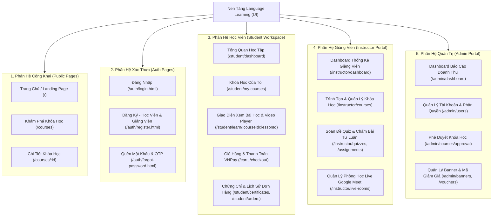

# KẾ HOẠCH & LỘ TRÌNH THIẾT KẾ GIAO DIỆN (UI/UX DESIGN PLAN)
## DỰ ÁN: NỀN TẢNG HỌC TRỰC TUYẾN E-LEARNING / LMS SAAS (LANGUAGE LEARNING)

> **Tài liệu tham chiếu:**  
> - Đặc tả Use Case: [`usercase.md`](file:///c:/Users/Admin/Downloads/SAAS/usercase.md)  
> - Kiến trúc hệ thống: [`project_architecture_plan.md`](file:///c:/Users/Admin/Downloads/SAAS/project_architecture_plan.md)  
> - Cơ sở dữ liệu: [`schema.sql`](file:///c:/Users/Admin/Downloads/SAAS/schema.sql)

---

## 🎨 1. Phong Cách Thiết Kế (Design System & Aesthetic Guidelines)

Hệ thống tuân thủ phong cách **Aura Morph Glassmorphism** hiện đại, mang lại cảm giác trẻ trung, mượt mà và cao cấp:

- **Bộ màu chủ đạo (Color Palette):**
  - **Primary Purple (Tím Aura):** `#9333ea` / `#a855f7` (Màu thương hiệu chính, nút action, highlight active).
  - **Accent Pink (Hồng Pastel):** `#ec4899` / `#f472b6` (Nút phụ, hiệu ứng gradient, chip ngôn ngữ).
  - **Sky Blue & Mint (Xanh Trời & Bạc Hà):** `#0ea5e9` / `#14b8a6` (Tiến độ học tập, thẻ thông tin).
  - **Background (Nền sáng Pastel):** `#f8fafc` kết hợp các khối Liquid Pastel Blobs di chuyển tự nhiên (`blob-rose`, `blob-lavender`, `blob-mint`).
- **Hình khối & Typography:**
  - **Hình khối (Organic Shapes):** Loại bỏ các góc vuông thô cứng. Tất cả card, input, button đều sử dụng bo góc mềm (`border-radius: 9999px` cho pill inputs/buttons, `border-radius: 36px` cho card).
  - **Phông chữ (Typography):** Google Fonts (`Plus Jakarta Sans` / `Inter` / `Noto Sans JP`).
- **Hiệu ứng chuyển động (Micro-interactions):**
  - Text rơi ngẫu nhiên Canvas background (`['日本語', 'こんにちは', 'hello', 'xin chao']`).
  - Hiệu ứng nghiêng 3D (Organic 3D Tilt) khi di chuột qua các thẻ container.
  - Floating badges tự do xung quanh màn hình.

---

## 📐 2. Sơ Đồ Kiến Trúc Màn Hình (UI Site Map & Route Architecture)

Hệ thống giao diện được chia thành **4 Phân hệ chính (4 Portals)** phục vụ đúng 4 vai trò người dùng:

---

## 📋 3. Chi Tiết Thiết Kế Giao Diện Từng Phân Hệ & Chức Năng

### 🔹 PHÂN HỆ 1: XÁC THỰC & TÀI KHOẢN (Auth Pages) — *Đã hoàn thiện thiết kế Aura Morph*
1. **Đăng nhập (`login.html`):**
   - Form Aura Glassmorphism dạng viên thuốc (Pill Inputs).
   - Nhãn hướng dẫn ẩn khi click vào ô nhập.
   - Nút đăng nhập Shimmer gradient tím hồng.
   - Thẻ chữ trôi trôi 🇬🇧 / 🇯🇵 giữ khoảng cách an toàn không bị đè.
2. **Đăng ký (`register.html`):**
   - Bộ chọn Vai trò: Học viên (`ROLE_USER`) / Giảng viên (`ROLE_INSTRUCTOR`).
   - Ô nhập "Mã mời giảng viên" tự động hiện/ẩn khi chọn Giảng viên.
   - Chọn ngôn ngữ mục tiêu: 🇬🇧 Tiếng Anh / 🇯🇵 Tiếng Nhật.
3. **Quên mật khẩu (`forgot-password.html`):**
   - Nhập Email -> Ô nhập mã OTP 6 số tự động nhảy focus -> Đặt mật khẩu mới.

---

### 🔹 PHÂN HỆ 2: CÔNG KHAI & KHÁM PHÁ (Public & Discovery)
1. **Trang Chủ (Landing Page - `index.html`):**
   - **Hero Section:** Banner slider trượt mượt mà, lời chào mừng và nút "Khám phá ngay".
   - **Bảng Ngôn Ngữ Nổi Bật:** Thẻ Tiếng Anh / Tiếng Nhật với hiệu ứng hover 3D tilt.
   - **Danh Sách Khóa Học Khuyên Dùng:** Grid 4 cột hiển thị ảnh bìa, giảng viên, đánh giá 5 sao, giá tiền và nút "Thêm vào giỏ".
   - **Thống Kê Số Liệu:** Số học viên, số bài giảng, tỷ lệ hoàn thành.
   - **Footer:** Chân trang phong cách glassmorphic chứa thông tin liên hệ & bản quyền.
2. **Trang Tìm Kiếm & Lọc Khóa Học (`courses.html`):**
   - **Thanh tìm kiếm thông minh:** Nhập từ khóa hỗ trợ gợi ý nhanh.
   - **Bộ lọc bên cạnh (Sidebar Filter):** Lọc theo Nhóm ngôn ngữ (Anh/Nhật), Trình độ (N5->N1, A1->C2), Mức giá, Đánh giá (từ 4 sao trở lên).
3. **Trang Chi Tiết Khóa Học (`course-detail.html`):**
   - **Trailer Video Player:** Xem thử video giới thiệu bài giảng.
   - **Khung thông tin bên phải (Sticky Checkout Card):** Giá bán, mã giảm giá, nút "Mua ngay" & "Thêm vào giỏ".
   - **Tab nội dung:** Giới thiệu khóa học, Chương trình học (Accordion mở rộng xem danh sách bài), Đánh giá của học viên (5 sao), Thông tin giảng viên.

---

### 🔹 PHÂN HỆ 3: WORKSPACE HỌC VIÊN (Student Workspace)
1. **Dashboard Học Viên (`student-dashboard.html`):**
   - **Khóa học đang học (In Progress):** Hiển thị thanh phần trăm tiến độ, nút "Học tiếp bài X".
   - **Lịch học Live sắp tới:** Đếm ngược thời gian phòng Google Meet sắp diễn ra.
2. **Giao Diện Xem Video Bài Học (Player Workspace - `learn.html`):**
   - **Khung phát Video chính:** Hỗ trợ điều chỉnh tốc độ phát, chế độ rảnh tay, tự chuyển bài khi xem xong.
   - **Cột danh sách bài học (Curriculum Sidebar):** Đánh dấu tích xanh bài đã xem xong, khóa bài chưa đến lượt.
   - **Hệ thống Tab tương tác dưới Video:**
     - 📝 **Ghi chú Timestamp:** Bấm "Thêm ghi chú" ở giây `02:45`, sau này click vào ghi chú video tự tua đến đúng giây đó.
     - 💬 **Hỏi đáp Q&A:** Đặt câu hỏi cho giảng viên theo từng bài học.
     - 📚 **Tài liệu bài học:** Download file PDF đề cương hoặc file Zip bài tập.
     - ✍️ **Bài tập tự luận & Quiz:** Làm bài trắc nghiệm tính điểm trực tiếp.
3. **Giỏ Hàng & Thanh Toán VNPay (`cart.html`, `checkout.html`):**
   - **Danh sách giỏ hàng:** Xóa khóa học, nhập mã Voucher (`CHAOMUNG2026`).
   - **Cổng thanh toán:** Chọn thanh toán VNPay QR / Thẻ ATM Test -> Chuyển sang màn hình xác nhận đơn hàng thành công.
4. **Chứng Chỉ & Lịch Sử Giao Dịch (`certificates.html`, `orders.html`):**
   - Hiển thị danh sách chứng chỉ PDF đã cấp khi đạt 100% khóa học kèm nút Tải Về.

---

### 🔹 PHÂN HỆ 4: QUẢN LÝ GIẢNG VIÊN (Instructor Portal)
1. **Dashboard Thống Kê Giảng Viên (`instructor-dashboard.html`):**
   - Thống kê tổng số học viên đăng ký, tổng doanh thu nhận được, số bài tập cần chấm.
2. **Trình Tạo & Chỉnh Sửa Khóa Học (`course-builder.html`):**
   - **Bước 1:** Nhập thông tin tổng quan (Tiêu đề, Mô tả, Giá tiền, Ảnh bìa, Ngôn ngữ).
   - **Bước 2:** Xây dựng Chương học & Upload Video (Hỗ trợ kéo thả bài học, upload video dung lượng lớn).
   - **Bước 3:** Đính kèm file PDF/Zip.
3. **Quản Lý Quiz & Chấm Điểm Bài Tập (`quizzes.html`, `assignments.html`):**
   - **Ngân hàng câu hỏi trắc nghiệm:** Soạn câu hỏi A/B/C/D, đánh dấu đáp án đúng & lời giải.
   - **Chấm bài tự luận:** Xem file bài làm của học viên, nhập điểm và viết phản hồi.
4. **Tạo Phòng Học Live Google Meet (`live-rooms.html`):**
   - Lên lịch giờ học, dán link Google Meet / Zoom để học viên tham gia.

---

### 🔹 PHÂN HỆ 5: QUẢN TRỊ VIÊN (Admin Portal)
1. **Báo Cáo Doanh Thu & Thống Kê (`admin-dashboard.html`):**
   - Biểu đồ cột doanh thu theo tháng (ApexCharts / Chart.js).
   - Thống kê top khóa học bán chạy nhất.
2. **Quản Lý Tài Khoản & Phân Quyền (`admin-users.html`):**
   - Bảng quản lý danh sách người dùng, nút khóa/mở khóa tài khoản, nâng quyền Giảng viên/Admin.
3. **Phê Duyệt Khóa Học (`admin-approval.html`):**
   - Xem trước nội dung khóa học giảng viên gửi lên -> Nút "Duyệt xuất bản" hoặc "Từ chối" (kèm lý do).
4. **Quản Lý Banner & Voucher (`admin-marketing.html`):**
   - Thêm/sửa banner trang chủ và tạo mã giảm giá toàn sàn.

---

## 🚀 4. Lộ Trình Triển Khai Giao Diện Chi Tiết (UI Implementation Roadmap)

| Giai Đoạn (Sprint) | Mục Tiêu Giao Diện (UI Milestones) | Các Màn Hình Cần Tạo / Cập Nhật | Trạng Thái |
| :--- | :--- | :--- | :---: |
| **Sprint 1** | **Xác thực & Design System** | `login.html`, `register.html`, `forgot-password.html` (Aura Morph Style) | **Đã hoàn thành 100%** |
| **Sprint 2** | **Trang Chủ & Khám Phá Khóa Học** | `index.html` (Landing Page), `courses.html` (Tìm kiếm & Lọc), `course-detail.html` (Chi tiết) | **Tiếp theo (Ưu tiên 1)** |
| **Sprint 3** | **Workspace Học Viên & Video Player** | `learn.html` (Giao diện xem video, Ghi chú Timestamp, Q&A, Quiz), `student-dashboard.html` | **Ưu tiên 2** |
| **Sprint 4** | **Giỏ Hàng & Thanh Toán VNPay** | `cart.html`, `checkout.html`, `order-success.html`, `certificates.html` | **Ưu tiên 3** |
| **Sprint 5** | **Phân Hệ Giảng Viên (Instructor)** | `instructor-dashboard.html`, `course-builder.html`, `quizzes.html`, `live-rooms.html` | **Ưu tiên 4** |
| **Sprint 6** | **Phân Hệ Quản Trị (Admin Portal)** | `admin-dashboard.html`, `admin-users.html`, `admin-approval.html`, `admin-marketing.html` | **Ưu tiên 5** |

---

## 🎯 5. Quy Chuẩn Kỹ Thuật UI/UX Dành Cho Lập Trình Viên
1. **Responsive Tối Đa:** Mọi màn hình phải hiển thị mượt mà trên Desktop (>1200px), Tablet (768px - 1024px) và Mobile (<768px).
2. **Hiệu ứng Đồng Bộ:** Áp dụng hệ thống class CSS dùng chung từ Auth Pages (`aura-vessel`, `pill-input-wrap`, `btn-aura`, `liquid-blob`, `fallingTextCanvas`).
3. **Tương Tác Nhanh (Fast Interaction):** Sử dụng các hiệu ứng Toast thông báo góc màn hình khi người dùng thực hiện hành động (Thêm giỏ hàng thành công, nộp bài thành công, đổi mật khẩu thành công).
